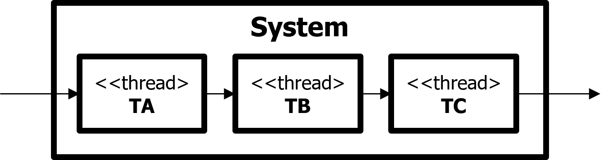

This is a simple project that demonstrates the module design process and architecture documentation.

### Object-Oriented Analysis & Design
The basic object-oriented analysis & design (OOAD) process is as shown in the figure below. Module design has same process and follows object-oriented design principles.

### Module design
#### Step 1. Identify Object / Component

Assume that it is designed as shown in the deployment view in terms of execution. It's a multi-threaded system composed of 3 threads.
- Thread A is composed of components U and A. U gets input from the user and requests A to process it. A processes the input and requests thread B to do more.
- Thread B is composed of components M1 and B. M1 gets a request from thread A and requests B to process it. B processes the requested and requests thread C to do more.
- Thread C is composed of components M2 and C. M2 gets a request from thread B and requests C to process it. C processes the requested to the user.

#### Step 2. Defile Class / Module

In basic, components can be mapped to modules. Components U, A, B and C are mapped to modules TU, TA, TB and TC. However, components M1 and M2 have almost identical behavior of getting requests from the other thread and requesting to the internal component to handle them. Components M1 and M2 are mapped to module TM, which means one module TM is instantiated to 2 different components M1 and M2.

#### Step 3. Refile Class / Module

5 modules TU, TM, TA, TB and TC defined in step 2 should be implemented. Module architecture should be refined to enhance maintainability.
- Modules TA, TB and TC are programs that implement request processing. Here, the common part is extracted into a separate module TP, which is extended to implement modules TA, TB and TC.
- Modules TM and TP are core and independent of business logic. They can be grouped into core layer, which is the lowest layer.
- TU is a module related to the user interface. Because the user interface changes frequently, it is placed at the top layer, the UI layer.
- Modules TA, TB and TC which implement business logic can be grouped into logic layer.
- The final module architecture is a three-layer architecture composed of UI, logic and core layers.

The designed module architecture needs validation.
- In the deployment view (left), component M1 uses component B(red arrow), but module TM must not depend on module TB in the module view (right).
- In the module view (right), module TB extends module TP, which module TM is allowed to use. So, component B instantiated in module TB is injected into component M1 as an instance of TP (dependency injection). M1 doesn't need to know TB. M1 only uses TP instances. Module TM doesn't depend on module TB.
- Same with components M2 and C.

### Architecture Documentation
The SW Architecture document consists of the following table of contents.

#### Chapter 1. Overview
In this chapter, the system should be defined clearly. The system is specified as a black box. Internal components are not in the system definition.

#### Chapter 2. Requirements
In this chapter, the more detail requirement should be specified. It's better to specify what the system should do with the request.

#### Chapter 3. Architecture
In this chapter, the designed architecture in terms of execution (as shown in the below view) should be explained - how the system works.

When describing an architecture which is complex, it is better to first describe an abstracted high-level one. In terms of execution, deployment view can be first.

The architecture designed in terms of execution is a multi-threaded system with 3 threads - threads TA, TB and TC.

The more detail system behavior can be described using a sequence diagram as shown below.

##### 3.1 thread TA

In section 3.1, the internals of thread TA can be described. Thread TA is composed of components U and A. Component U gets input from the user and requests component A to handle it. Component A processes the request and requests thread B to do more. The detail flow can be described using a sequence diagram as shown below.

#### Chapter 4. Module
In this chapter, the designed architecture in terms of development should be explained - how the system should be implemented.
