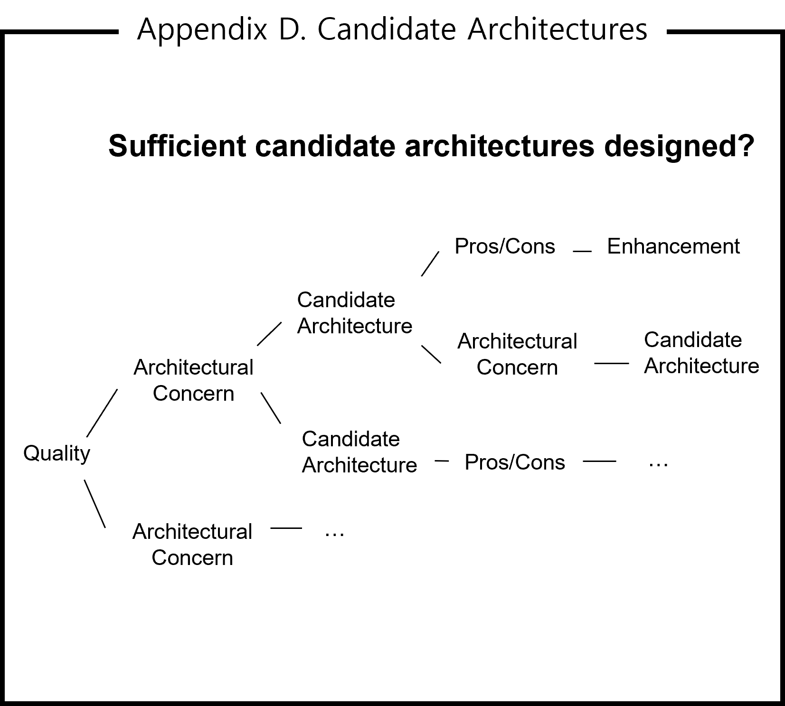

This is a simple project that demonstrates the module design process and architecture documentation. This project implements the designed architecture in Java. This helps to understand concept of S/W elements - components, modules and their mappings to code.

### Object-Oriented Analysis & Design
The basic object-oriented analysis & design (OOAD) process is as shown in the figure below. Module design has same process and follows object-oriented design principles.

### Module design
#### Step 1. Identify Object / Component

Assume that it is designed as shown in the deployment view in terms of execution. It's a multi-threaded system composed of 3 threads.
- Thread A is composed of components U and A. U gets input from the user and requests A to process it. A processes the input and requests thread B to do more.
- Thread B is composed of components M1 and B. M1 gets a request from thread A and requests B to process it. B processes the requested and requests thread C to do more.
- Thread C is composed of components M2 and C. M2 gets a request from thread B and requests C to process it. C processes the requested to the user.

#### Step 2. Define Class / Module

In basic, components can be mapped to modules. Components U, A, B and C are mapped to modules TU, TA, TB and TC. However, components M1 and M2 have almost identical behavior of getting requests from the other thread and requesting to the internal component to handle them. Components M1 and M2 are mapped to module TM, which means one module TM is instantiated to 2 different components M1 and M2.

#### Step 3. Refine Class / Module

5 modules TU, TM, TA, TB and TC defined in step 2 should be implemented. Module architecture should be refined to enhance maintainability.
- Modules TA, TB and TC are programs that implement request processing. Here, the common part is extracted into a separate module TP, which is extended to implement modules TA, TB and TC.
- Modules TM and TP are core and independent of business logic. They can be grouped into core layer, which is the lowest layer.
- TU is a module related to the user interface. Because the user interface changes frequently, it is placed at the top layer, the UI layer.
- Modules TA, TB and TC which implement business logic can be grouped into logic layer.
- The final module architecture is a three-layer architecture composed of UI, logic and core layers.

The designed module architecture needs validation.
- In the deployment view (left), component M1 uses component B(red arrow), but module TM must not depend on module TB in the module view (right).
- In the module view (right), module TB extends module TP, which module TM is allowed to use. So, component B instantiated in module TB is injected into component M1 as an instance of TP (dependency injection). M1 doesn't need to know TB. M1 only uses TP instances. Module TM doesn't depend on module TB.
- Same with components M2 and C.

### Architecture Documentation
The SW Architecture document consists of the following table of contents.

#### Chapter 1. Overview
In this chapter, the system should be defined clearly. The system is specified as a black box. Internal components are not in the system definition.

</img>

#### Chapter 2. Requirements
In this chapter, the more detail requirement should be specified. It's better to specify what the system should do with the request.

</img>

#### Chapter 3. Architecture
In this chapter, the designed architecture in terms of execution (as shown in the below view) should be explained - how the system works.

When describing an architecture which is complex, it is better to first describe an abstracted high-level one. In terms of execution, deployment view can be first.

The architecture designed in terms of execution is a multi-threaded system with 3 threads - threads TA, TB and TC.

</img>

The more detail system behavior can be described using a sequence diagram as shown below.

</img>

##### 3.1 thread TA

In section 3.1, the internals of thread TA can be described. Thread TA is composed of components U and A.

</img>

Component U gets input from the user and requests component A to handle it. Component A processes the request and requests thread B to do more. The detail flow can be described using a sequence diagram as shown below.

</img>

In the same way, the internals of threads TB and TC can be explained in sections 3.2 and 3.3.

#### Chapter 4. Module
In this chapter, the designed architecture in terms of development should be explained - how the system should be implemented.

It is better to first describe the top level view (layered view) instead of the complex overall module view.

</img>

The designed architecture in terms of development is 3 layered architecture, which is composed of UI, logic and core layer.
- UI layer is allowed to use (depend on) logic and core layer.
- Logic layer is allowed to use core layer but not to use UI layer.
- Core layer is not allowed to use UI and logic layer.

##### 4.1 Core layer
In section 4.1, the internals of core layer can be described. Core layer is composed of modules TM and TP.

</img>

###### 4.1.1 TM
In section 4.1.1, module TM can be described using providing / required interfaces. Module TM should provide interface InterfaceTM.

</img>

In the same way, the internals of other layers can be described in Sections 4.2 and 3.3.

#### Appendix
The appendix helps the reader to understand how to approach architectural design. It should answer important questions to the reader.

#### Question 1. rationale to design the final architecture
What made you design the final architecture? The reader wants to know the top-level views in terms of execution (chapter 3) and development (chapter 4).

Appendix F describes the rationale for designing the top-level architecture. In the architectural design process, the final architecture was incorporated from selected candidate architectures. They can be rationales to design the final architecture.

#### Question 2. rationale for architectural decisions
What made you decide on the architectural decision (candidate architecture)? The reader wants to know why you choose the design over alternatives.

Appendix E describes the rationale for deciding architectural decisions. In the architectural design process, candidate architectures were evaluated according to quality requirements and selected from the evaluation. They can be rationales for architectural decisions.

#### Question 3. proof of optimal architecture
Is the designed architecture optimal? The reader wants to know how much close the designed architecture is to the optimal.

</img>

Appendix D describes the proof of optimal architecture design - how to approach to design candidate architectures from quality requirements. What are architectural concerns to enhance quality requirement? What are candidate architectural decisions to address them? What are mitigating solutions for the weakness of the candidate architectures? How much considered to get the optimal architecture design needs to be explained.

Domain model is a conceptual architecture for providing functional requirements, which doesn't reflect quality requirements. The analysis of quality requirements and the design of candidate architectures in appendix D are based on the domain model. Appendix A describes the domain model.

</img>

#### Question 4. rationale for quality requirements
What made you determine quality requirements?
- high-priority quality attributes
- low-priority quality attributes
- non-functional requirements
- ignored quality scenarios

</img>

Appendix C describes the rationale for quality requirements. Quality requirements were determined based on analysis of quality scenarios according to importance and difficulty. They should be aligned with business drivers. Ultimately, they are determined by stakeholders.

#### Question 5. rationale for missing quality requirements
Why did you miss quality requirements? The reader wants to know how to create quality scenarios.

</img>

Appendix B describes the way how to create quality scenarios.
- scenario generation in utility tree (top-down approach)
- brainstorming with stakeholders (bottom-up approach)
- quality attribute workshop
